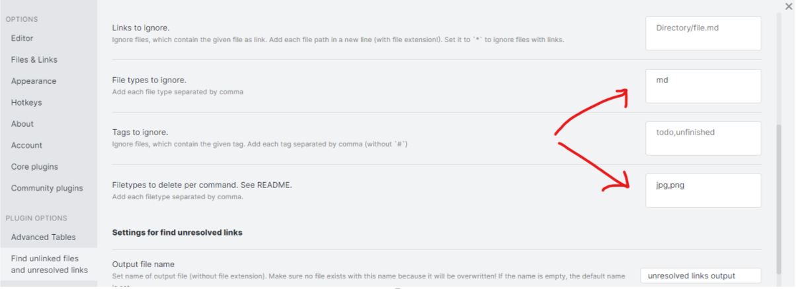
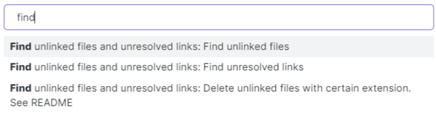

# Documentation, tutorials  
https://obsidian.md/  
[Obsidian documentation](https://publish.obsidian.md/help/Index)  
  
[awesome-obsidian](https://github.com/kmaasrud/awesome-obsidian)  
  
[ProductivityGuru tutorials](https://www.youtube.com/c/ProductivityGuru/playlists)  
[Linking Your Thinking tutorials](https://www.youtube.com/channel/UC85D7ERwhke7wVqskV_DZUA/playlists)  
  
  


# Hotkeys

В русской раскладке некоторые символы разметки могут вызывать сложности или быть вообще не доступны (к примеру символ \`), поэтому плагин Shortcuts extender дублирует почти все символы латинской раскладки через Alt (Alt + ё для \` ).

### Edit text
|                                |                                                                   |
| ------------------------------ | ----------------------------------------------------------------- |
| **Alt + Click**                | Muticursor                                                        |
| **Ctrl + Shift + V**           | Paste as text (вставить без эскейпинга и форматирования)          |
| **Ctrl + B**                   | Toggle bold                                                       |
| **Ctrl + K**                   | Insert link                                                       |
| **Ctrl + Shift + K**           | Paste URL into selection                                          |
| **Alt + Up/Down** (cutom)      | Swap line up/down                                                 |
| **Ctrl + D**                   | Delete paragraph                                                  |
| **Alt + Enter**                | Follow link under cursor                                          |
| **Shift + Enter** (custom key) | Insert line below (Hotkeys++)                                     |
| **Ctrl + Shift + M**           | Toggle to bulleted/numbered list (Hotkeys++)                      |
| **Alt + -**                    | Creating list item (Shortcuts extender)                           |
| **Ctrl + M**                   | Toggle to todo list (Hotkeys++)                                   |
| **Ctrl + Enter**               | Toggle checklist (todo) status                                    |
| **Ctrl + 1-6**                 | Level 1-6 heading (Shortcuts extender)                            |
| **Ctrl + 0**                   | Clearing of text formatting (Shortcuts extender)                  |
| **Ctrl + Shift + C**           | Note refactor: Extract selection to new note (content only)       |
| **Ctrl + Shift + N**           | Note refactor: Extract selection to new note (first line as name) |
| **Ctrl + Alt + Shift + H**     | Note refactor: Split note by headings H1                          |

### Edit table
|                                      |                                                       |
| ------------------------------------ | ----------------------------------------------------- |
| **Tab / Shift + Tab**                | Navigate between table cels (Advancet tables binding) |
| **Enter**                            | Go to next table row (Advancet tables binding)        |
| **Ctrl + Alt + Left/Right** (custom) | Move column left/right (Advancet tables)              |
| **Ctrl + Alt + Up/Down** (custom)    | Move row up/down (Advancet tables)                    |
| **Ctrl + X**                         | Cut line                                              |
| **Ctrl + Alt + X** (custom)          | Delete column (Advancet tables)                       |
| **Ctrl + Alt + С** (custom)          | Insert column before (Advancet tables)                |
| **Ctrl + Alt + R** (custom)          | Insert row before (Advancet tables)                   |


### Interface
|                                 |                                         |
| ------------------------------- | --------------------------------------- |
| **Ctrl + +/-**                  | Scale interface                         |
| **Ctrl + N**                    | New note                                |
| **Ctrl + E**                    | Toggle edit/preview mode                |
| **Alt + Left** (custom)         | Navigate back                           |
| **Alt + Right** (custom)        | Navigate forward                        |
| **Ctrl + W**                    | Close tab                               |
| **Ctrl + Click on note**        | Open in new tab (In preview mode only)  |
| **Ctrl + O**                    | ~~Open quick switcher~~                 |
| **Ctrl + O**                    | Open Switcher++: Open                   |
| **Alt + O**                     | Open Switcher++: Open in Symbol Mode    |
| **Ctrl + P**                    | Open command palette                    |
| **Ctrl + Shift + O** (custom)   | Open in default app                     |
| **Ctrl + Space** (custom)       | Reveal active file in navigation        |
| **Ctrl + F**                    | Search current file                     |
| **Ctrl + H**                    | Search and replace                      |
| **Ctrl + Shift + F**            | Search in all files                     |
| **Ctrl + ,**                    | Settings                                |
| **Ctrl + R**                    | Restart Obsidian (after plugin install) |
| **Ctrl + Alt + S** (custom key) | Obsidian git: Commit and push           |
| **Ctrl + Alt + L** (custom key) | Obsidian git: Pull                      |


# Settings

Для совместимости страниц с другими программами (для публикации страниц на github например) обязательно нужно изменить опции:  

**Формат новой ссылки**: Относительный путь к файлу  
**Использовать Wiki-ссылки**: false  

**Не стоит использовать wiki-ссылки** `[[link]]`, чтобы в последствии не иметь проблем с совместимостью с другими программами и деплоем страниц в веб. Используем обычные ссылки `[text](link)`. Если у нас уже имеются wiki ссылки, то их можно [сконвертировать](Obsidian.md#Как%20сконвертировать%20wiki-ссылки%20в%20обычные%20markdown).  


# Functions

- **Линки между страницами** (включая линки на конкретный абзац или предложение)
- **Мультикурсор** (Alt+Click)
- **Сворачивание заголовков**
- **Подсветка кода**
- **Окно со структурой страницы с навигацией**
- **Меню быстрого перехода между страницами с поиском** (Ctrl+O)
- **Навигация вперед/назад** (Ctrl+Alt+Left\Right)
- **Меню команд** (Ctrl+P)
- **Внешние ссылки на страницы** (вставив в браузер, откроется приложение с нужной страницей)
- **Темная и светлая тема** (быстрое переключение) + кастомные темы
- **Переключение между режимом отображения и редактирования** (Ctrl+E)
- **Поиск с заменой** (Ctrl+H)
- **Поиск по всем заметкам** (Ctrl+Shift+F)
- **Экспорт в PDF**
- С помощью всплывающего превью ссылок на страницы можно **сделать хинты на различные термины** 
- Все установленные **плагины, темы и настройки сохраняются вместе в папке с markdown-файлами**, поэтому при открытии библиотеки все подтягивается автоматически.
- Перетягиванием заметки из правой панели на рабочий стол, можно сделать **ярлык на заметку**.
- В настройках можно включить встроенный плагин, который добавляет **панель с избранным**. На нее можно добавлять как отдельные страницы, так и строки поиска страниц. Отдельным плагином ([Hotkeys for starred files and searches](https://github.com/Vinzent03/obsidian-shortcuts-for-starred-files)) можно добавить хоткеи на избранные страницы.
- **Настраиваемый лейаут** - можно открыть несколько заметок вертикально/горизонтально (Ctrl+Click по заметке). Все панели интерфейса можно перемещать и закреплять в других местах. Для этого нужно тянуть за иноку панели. К примеру, панель Outline (навигация по главам) удобно переместить влево, если монитор маленькой диагонали. 
- **Синхронизировать базу можно через любое облако**, а еще лучше через git. Для pull/push в git есть плагин [Obsidian Git](https://github.com/denolehov/obsidian-git). 
- **Результаты поиска (который на Ctrl+Shift+F) можно вставлять прямо в заметку** ([Embed search](https://publish.obsidian.md/help/Plugins/Search)). Вывод можно кастомизировать темплейтом с помощью [плагина](https://github.com/mrjackphil/obsidian-text-expand).


# Hot to use Obsidian with other apps

### Typora, Marktext
Obsidian можно совмещать с другими редакторами, например [typora](https://typora.io/#windows) или [marktext](https://github.com/marktext/marktext), которые имеют удобные редакторы таблиц, и позволяют редакторировать текст в режиме WYSIWYG.  
Чтобы иметь максимальную совместимость markdown формата с другими программами, в Obsidian нужно настроить формат ссылок, отключив wiki-links и включив относительные пусти в ссылках. Typora (в отличие от Obsidian) поддерживает вставку таблиц, скопированных из OneNote.  
[Как поменять Enter и Shift+Enter местами в typora](https://github.com/typora/typora-issues/issues/37).  

Можно сделать Typora дефолтным редактором md файлов в системе и легко переключаться на него из Obsidian по хоткею Open in default app.  

### VSCode
В VSCode, можно поставить следующие плагины:  

[Markdown Memo](https://marketplace.visualstudio.com/items?itemName=svsool.markdown-memo) (поддерживает ссылки на другие страницы и изображения, но не поддерживается ссылка на заголовок или блок)  

Чтобы писать страницы можно поставить:  

[Foam for VSCode](https://marketplace.visualstudio.com/items?itemName=foam.foam-vscode)  

[Markdown All In One](https://marketplace.visualstudio.com/items?itemName=yzhang.markdown-all-in-one)  

Чтобы работали wiki-ссылки, в VSCode надо открывать папку со всеми страницами.  

Чтобы VSCode переносил строки от одного символа разделения строк (такой формат используется в obsidian по дефолту), включаем опцию Markdown > Preview: Breaks.  

Можно так же поставить Discoord Theme.  

# Tips and tricks

### Навигация по всем заметкам определенной темы или блокнота  
Удобно создать страницу с ссылками на все страницы определенной темы или блокнота и закрепить эту траницу в левой панельке возле списка файлов. В отличие от списка файлов, тут можно рассортировать заметки в нужной последовательности и добавить оформление для удобного поиска.

### Changelog panel

На левой панельке можно закрепить траницу, которую генерирует плагин Vault Changelog. Это еще один быстрый способ навигации по последним страницам.

### Поиск текста в заметках

Поле ввода текста для поиска имеет огромный функционал.

/hello.\*world/ - пример RegExp

/Тест для поиска/ - обычный текст для поиска пишем как RegExp между / /

path:FolderName - можно указать папку, в которой искать

К примеру, мы помним, что писали про хоткей Shift+Enter, но не помним, писали как Shift+Enter или Shift + Enter, или как-то еще. В поиске пишем: 
/Shift.*Enter/

/forward.?vector/ - в результате поиска будет "forwardvector", "forward vector", "forward-vector"...

В условии поиска как RegExp нужно экранировать специальные символы. К примеру:
/Shift\+Enter/

### Как почистить бибилотеку от изображений и других файлов, которые уже не используются

Ставим плагин [Find unlinked files](https://github.com/Vinzent03/find-unlinked-files).

В настройках плагина прописываем, чтобы он игнорировал md файлы (не выводил в список незалинкованных файлов ) и удалял только изображения:




В меню Ctrl+P есть три операции:



Первая выводит список незалинкованных файлов

Вторая выводит список битых ссылок

Третья удаляет все незалинкованные файлы с указанным в настройках расширением.


### Как сконвертировать wiki-ссылки в обычные markdown

Такая фича есть в [Consistent attachments and links](https://github.com/derwish-pro/obsidian-consistent-attachments-and-links).
 

### Особенность с умным поиском путей  
Obsidian имеет умный поиск путей ссылок и вложений в заметках. К примеру, ссылка может говорить что изображение надо загружать из attachments\\image1.png, и где бы не лежала эта папка attachments в иерархии загруженных папок, она будет найдена. Это с одной стороны плюс - сложнее сломать ссылки, с другой стороны минус - другие программы (или например githab) не поддерживают это, и ссылка окажется битой. Так же это может привести к тому, что была ссылка на одно изображение, а отображается другое, имеющее такое же название.
**Как определить реальный путь к изображению/ссылке в открытой заметке**  
В режиме редактирования RMB по ссылке \> Reveal file in navigation, Obsidian подсветит файл на панели слева.  


### Как расшарить страницы онлайн

[PCloud](https://www.pcloud.com/ru/eu) - Страницы можно преобразовать в html с помощью какого-нибудь SSG (static site generator) и закачать в Public Folder в PCloud. Html из общей папки рендерится в браузере без каких-либо банеров pcloud, т.е. это вполне подходящий хостинг.


[Github Pages](https://pages.github.com/) - Только один сайт на git-аккаунт. Только публичный доступ. Можно закачивать markdown формат и он автоматически будет сконвертирован в html.

[Setting a Markdown processor for your GitHub Pages site using Jekyll](https://docs.github.com/en/github/working-with-github-pages/setting-a-markdown-processor-for-your-github-pages-site-using-jekyll)

[Netlify](https://www.netlify.com/pricing/) - Бесплатный хостинг html с очень гибкими натсройками деплоя. Умеет автоматически деплоить из гитхаб.

[Publish your Obsidian Vault to your Digital Garden](https://yordi.me/publish-your-obsidian-vault-to-your-digital-garden/)

[Notenote.link - Publish your Obsidian notes with Jekyll for free!](https://forum.obsidian.md/t/notenote-link-publish-your-obsidian-notes-with-jekyll-for-free/7951)

[Vercel](https://vercel.com/pricing) - Аналог Netlify

[Gatsby](https://www.gatsbyjs.com/) - Аналог Netlify

[Creating a DIY Digital Garden with Obsidian and Gatsby](https://dev.to/bathrobe/creating-a-diy-digital-garden-with-obsidian-and-gatsby-378e)

[GitBook](https://www.gitbook.com/)


# Plugins

Все плагины для Obsidian - опенсорные, что позволяет проинспектировать их код перед установкой.

[Advanced Tables](https://github.com/tgrosinger/advanced-tables-obsidian) - расширение для создания таблиц. Поддерживаются [формулы](https://github.com/tgrosinger/advanced-tables-obsidian/blob/main/docs/help.md#using-formulas-in-markdown-tables)) и экспорт в CSV

[Editor Syntax Highlight](https://github.com/deathau/cm-editor-syntax-highlight-obsidian) - подсветка кода

[Obsidian Git](https://github.com/denolehov/obsidian-git) - push/pull из гита, автобэкап

[Note Refactor](https://github.com/lynchjames/note-refactor-obsidian) - рефакторинг страниц (разделение на несколько, …)

[Paste URL into selection](https://github.com/denolehov/obsidian-url-into-selection) - упрощенная вставка ссылок

[Find unlinked files](https://github.com/Vinzent03/find-unlinked-files) - поиск файлов, на которые уже нет ссылок

[Hotkeys++](https://github.com/argenos/hotkeysplus-obsidian) - полезные хоткеи

[Shortcuts extender](https://github.com/ryjjin/Obsidian-shortcuts-extender) - полезные хоткеи

[Meld Encrypt](https://github.com/meld-cp/obsidian-encrypt) - шифрование текста

[Obsidian Charts](https://github.com/phibr0/obsidian-charts) - графики

[Vantage - Advanced search builder](https://github.com/ryanjamurphy/vantage-obsidian) - продвинутый поиск с условиями

[Note Folder Autorename](https://github.com/pjeby/note-folder-autorename) - дабавляет команду, которая для текущей заметки создает папку, перемещает заметку в эту папку и следит за совпадением их имен при переименовании. Дополнительно можно испоользовать [Folder Note Plugin](https://github.com/xpgo/obsidian-folder-note-plugin), чтобы автоматически открывалась заметка при нажатии на папку.

[Filename Heading Sync](https://github.com/dvcrn/obsidian-filename-heading-sync) - автоматически добавляет первый заголовок в файл с именем файла и следит за их соотвествием при переименовании (только в режиме редактирования страницы). Плагин не совместим с YAML-метаданными, т.к. вставляет заголовок до блока с метаданными ([issue](https://github.com/dvcrn/obsidian-filename-heading-sync/issues/4))

[Page Headings From Links](https://github.com/beet/page-headings-obsidian-plugin) - похожий функционал, но плагин менее функционален

[Markdown Formatting Assistant](https://github.com/Reocin/obsidian-markdown-formatting-assistant-plugin) - добавляет инструменты форматирования текста (есть функция окраски цветом)

[Prettier Format](https://github.com/hipstersmoothie/obsidian-plugin-prettier) - авто-форматирование разметки, чтобы было красиво

[Markdown prettifier](https://github.com/cristianvasquez/obsidian-prettify) - авто-форматирует разметку, добавляет/апдейтит дату изменение заметки в YAML-метаданные по хоткею. 

[Recent Files](https://github.com/tgrosinger/recent-files-obsidian) - добавляет панель со списком последних открытых страниц (по сути дублирует окно Ctrl+O, с той лишь разницей, что панель может быть всегда открыта перед глазами)

[Automatically Reveal Active File](https://github.com/shichongrui/obsidian-reveal-active-file) - подсвечивает открытый файл на панели файлов слева. Удобно при переходе между страницами по ссылке. Может конфликтовать с другими плагинами, например [Recent Files](https://github.com/tgrosinger/recent-files-obsidian), т.к. переводит фокус на себя.

[Hotkeys for starred files and searches](https://github.com/Vinzent03/obsidian-shortcuts-for-starred-files) - позволяет задать хоткей для 9 избранных страниц

[Convert url to preview (iframe)](https://github.com/FHachez/obsidian-convert-url-to-iframe) - позволяет автоматически вставлять iframe для ссылок на ютуб, т.е. встраивать видео в страницу.

[Quick Switcher++](https://github.com/darlal/obsidian-switcher-plus) - добавляет обертку поверх стандартного окна Quick Switcher, позволяющую отображать заголовки и осуществлять навигацию по ним.

[Copy button for code block](https://github.com/natpalmer-e4o4/obsidian-code-block-copy) - добавляет кнопку Copy в блоки кода

[Footlinks](https://github.com/DahaWong/obsidian-footlinks) - рефакторит все ссылки, переделывая их в Footlinks

[Dataview](https://github.com/blacksmithgu/obsidian-dataview) - позволяет использовать vault как базу данных, делать выборку данных из md-страниц.

[Obsidian Query Language](https://github.com/jplattel/obsidian-query-language) - похожий на [Dataview](https://github.com/blacksmithgu/obsidian-dataview) плагин, но вытягивает не данные из страниц, а сами страницы.

[Wikilinks to MDLinks](https://github.com/agathauy/wikilinks-to-mdlinks-obsidian) - конвертирует Wiki-links в обычные markdown линки и обратно.

[Dangling links](https://github.com/graydon/obsidian-dangling-links) - добавляет панель, на которой отображаются все битые ссылки (только на ссылки, не вложения)

[Text Expander](https://github.com/konodyuk/obsidian-text-expander) - позволяет вставлять и выполнять код на python или shell-комманды прямо в тексте страницы.

[Snippets plugin](https://github.com/cristianvasquez/obsidian-snippets-plugin) - похожий функционал, как у [Text Expander](https://github.com/konodyuk/obsidian-text-expander) 

[CSV Editor](https://github.com/deathau/csv-obsidian) - редактор таблиц в формате CSV

[Sort and Permute lines](https://github.com/Vinzent03/obsidian-sort-and-permute-lines) - сортировка строк по алфавиту

[query2table](https://github.com/avirut/obsidian-query2table) - создает таблицу со списком страниц и значений из YAML-метаданных

[Vault Changelog](https://github.com/MrZeroo00/obsidian-vault-changelog) - автоматически добавляет changelog при изменении файлов

[Footnote Shorcut](https://github.com/akaalias/obsidian-footnotes) - автоматически ставит номер в footnote-линках

[Admonition](https://github.com/valentine195/obsidian-admonition) - блоки текста Note, Warning, Info, Question, Bug и др.


[LanguageTool](https://github.com/Clemens-E/obsidian-languagetool-plugin) - проверка грамматики

[Buttons](https://github.com/shabegom/buttons) - позволяет добавлять в текст заметки кнопки, которые могут выполнять различные команды

[Outliner](https://github.com/vslinko/obsidian-outliner) - хоткеи для создания списков


# Мои плагины
[Сode block from selection](https://github.com/derwish-pro/obsidian-code-block-from-selection) - добавляет хоткей для быстрого оформления текста в виде блока кода

[Remember cursor position](https://github.com/derwish-pro/obsidian-remember-cursor-position) - запоминает положение курсора и скрола

[Unique attachments](https://github.com/derwish-pro/obsidian-unique-attachments) - переименовывает вложения на основе хэш-функции

[Consistent attachments and links](https://github.com/derwish-pro/obsidian-consistent-attachments-and-links) - наводит порядок в библиотеке, делая ее более консистентной

[Find and replace in selection](https://github.com/derwish-pro/obsidian-find-and-replace-in-selection) - поиск и замена текста в выделенном тексте. Поддерживаются RegExp.


# Tools

[GitHub + Mermaid Chrome extension](https://chrome.google.com/webstore/detail/github-%20-mermaid/goiiopgdnkogdbjmncgedmgpoajilohe) 
[GitHub + Mermaid Firefox extension](https://addons.mozilla.org/en-GB/firefox/addon/github-mermaid/)

[oboe](https://github.com/kmaasrud/oboe) - Oboe is a Python command line tool made to convert an Obsidian vault into a vault of HTML files, with the goal of publishing them as static files. Publishing your vault automatically to GitHub Pages.


# Какие доп.фичи хотелось бы иметь

- WYSIWYG (в разработке)
- Более продвинутый визуальный редактор таблиц (как в typora и marktext)
- Скрывать папки/файлы определнного разрешения на панели с файлами, чтобы не наблюдать вложения
- Запоминать историю позиции курсора и двигаться по ней назад/вперед хоткеем
- Публикацию страниц в веб, например Github Gist с [вложениями](https://gist.github.com/remarkablemark/feff40b0a522f0c41c4eff0b77ea1d47)
- Автоматическое создание страницы с сылками на все страницы из папки, или другой вариант создания кастомной сортировки страниц


# Как редактировать тему
Чтобы добавить css поверх существующеего стиля, создаем css файл с произвольным именем в `.obsidian\snippets` и включаем его в настройках.

Пример, как сделать отступы к заголовкам:
```css
.markdown-preview-view h1 {
 padding-top: 70px;
 padding-bottom: 5px;
}

.markdown-preview-view h2 {
 padding-top: 10px;
} 

.cm-s-obsidian .HyperMD-header-1 {
 padding-top: 70px;
 padding-bottom: 5px;
}

.cm-s-obsidian .HyperMD-header-2 {
 padding-top: 10px;
 padding-bottom: 5px;
} 
```
